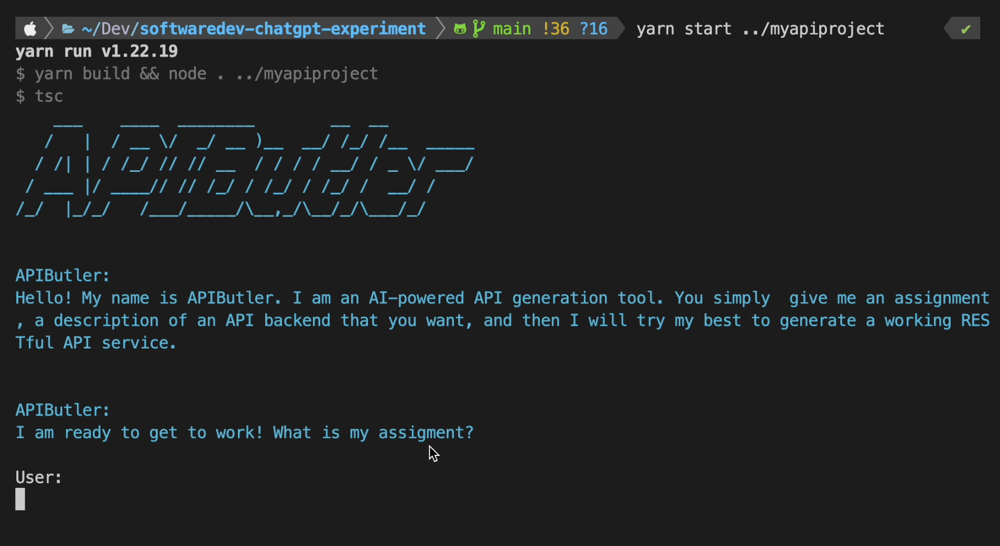
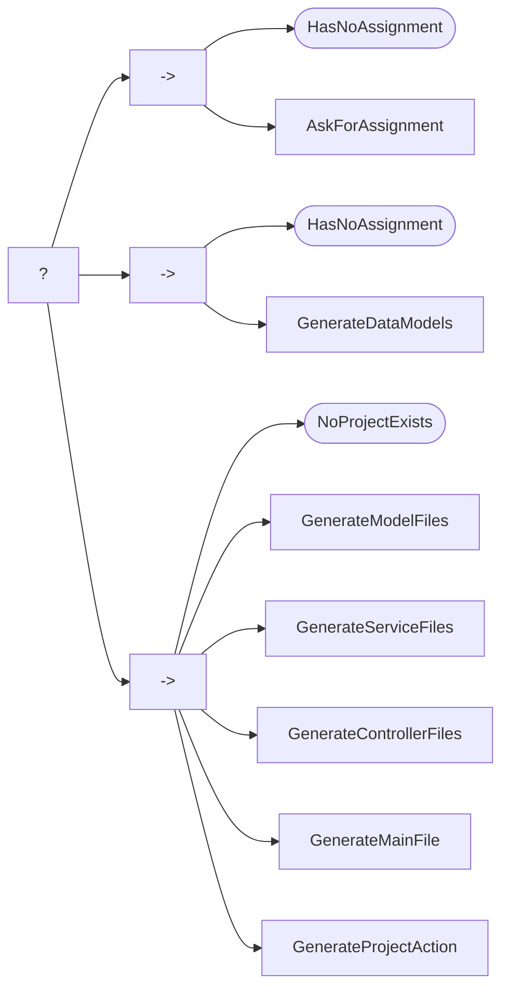

# apibutler-experiment

APIButler is a small experiment I created to test the capabilities of OpenAI's ChatGPT API. The goal of this experiment is to see if the ChatGPT API could be used  in the generation of backend API apps.



## Background

From my testing, I found ChatGPT to be lacking when attempting to generate the correct steps to develop a backend API application. However, when given an example input of a description of an application and an example output of generated JavaScript, ChatGPT performed much better.

After iterating through a few attempts, I settled on creating an AI agent that looks at an existing NodeJS project to generate the backend application, based on the user's prompt.

## Getting Started

### Requirements
 - OpenAI API Key
 - NodeJS >= 16.x or greater.

### Running APIButler

Update `clients/chatgpt/Index.ts`, setting the OpenAI key to your own key (I know this is not ideal practice, but I haven't gotten around to add dotenv).

Install dependencies using `yarn`. Next, simply run `yarn start ./my-empty-directory` and you should see the APIButler agent start up.

### Example Prompts

The following are some example prompts that I have submitted and have resulted in successfully generated NodeJS project.

Try them out!

#### Ride Sharing App
```
The product team is creating a new ride sharing app and needs a backend api. The api needs to be able to keep track of two entities: drivers and trips. Each Driver entity must keep track of things like, name of the driver, car make, car model, city, and state. Trips, on the other hand, must store data such as date, time, driver that owns the trip, start address, and end address. We need to create a microservice to allow clients to perform CRUD operations on each entity.
```

#### Recipe Management App
```
The product team wants to create a new recipe managment application to sell to customers. This recipe management application will allow users to create and manage recipes. Each recipe has a title, a description, number of calories, a list of ingredients, and a list of steps. The application also needs to manage invidual user accounts. Each recipe belongs to a specific user. Each user has an email, password, first name, last name, etc. We need a microservice that meets these requirements.
```

#### E-Learning Platform
```
I want to create a new e-learning platform. This platform will be used to allow students to connect and complete courses to earn certificates. We need a backend API that is able to store multiple courses. Each course will have a title, a topic, lessons, lecture videos, quizzes, etc. Each course is owned and maintained by an instructor. Each instructor can login to the application and manage their courese. Each student can also login to enroll in courses, complete course material, etc. We need a backend API that is able to manage all of this.
```

#### Microblogging Social Media Platform
```
A new startup wants to launch a new social media platform. This platform will allow users to post micro-blogs, small posts less than 140 characters. Each post will be called a "Bleep". Users are able to follow other users. Everytime a user bleeps, all of their followers will see their bleep on their feed. Users can also like other users' bleeps. Each user is able to login, create their own profile, and search for users to follow. We need a backend API to meet these requirements.
```

#### Restaurant Reservation Management App
```
A tech company wishes to create a brand new restaurant reservation management application. This app will be used to allow customers to look to see if a restaurant has any available tables at a given day and time. Once a customer has reserved a table, no other customer can reserve it. We need a backend API to keep track of all the available timeslots for a restaurant. The API needs to store data on each restaurant including name, address, available time slots, etc. We need to make sure we store the first name, last name, and phone number for a customer for each reservation. Please generate a microservice to meet these requirements.
```

## The AI Agent

This is the basic flow of the agent:
 1. Ask for an assignment from the user.
 2. Generate a collection of data schemas from the user's assignment prompt.
 3. Generate a JavaScript model class file from each data schema.
 4. Generate a JavaScript service class from each model class.
 5. Generate a JavaScript controller class from each service class.
 6. Generate a JavaScript index from all the controllers.
 7. Copy over any static files (config, Dockerfile, etc.).

I decided (may have been overkill) to utilize behavior trees to define the how the agent should interact with the user.

### APIButler Behavior Tree

