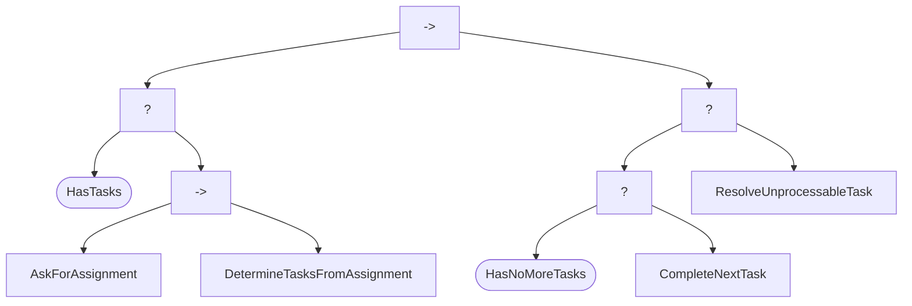
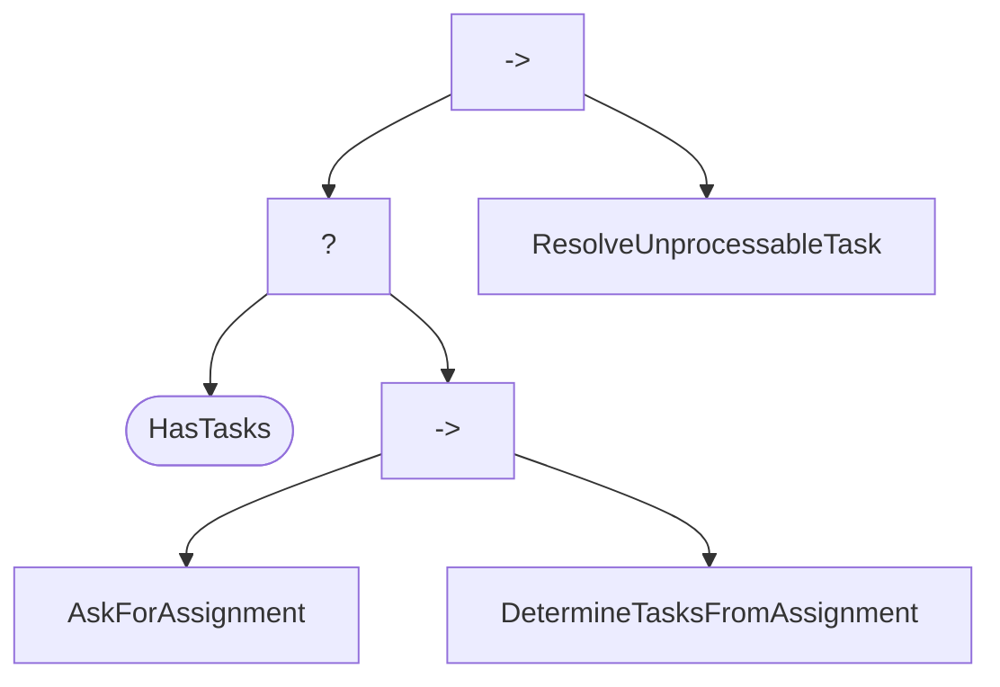

# softwaredev-chatgpt-experiment

### Software Development Agent Behavior Tree

```mermaid
flowchart TD
    A[->] --> B[?]
   
    B[?] --> D([HasTasks])

    B --> E[->]
    E --> F[AskForAssignment]
    E --> G[DetermineTasksFromAssignment]

    A --> C[?]

    C --> H[?]

    H --> I([HasNoMoreTasks])
    H --> J[CompleteNextTask]

    C --> K[ResolveUnprocessableTask]

```

### Potential

```mermaid
flowchart TD
    A[->] --> B[?]
   
    B[?] --> D([HasTasks])

    B --> E[->]
    E --> F[AskForAssignment]
    E --> G[DetermineTasksFromAssignment]

    A --> C[ResolveUnprocessableTask]

```